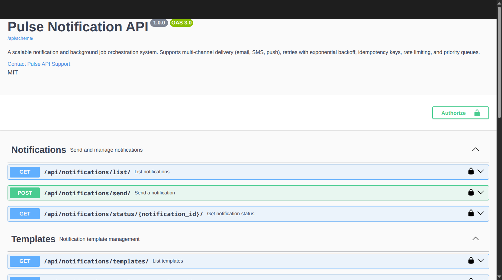
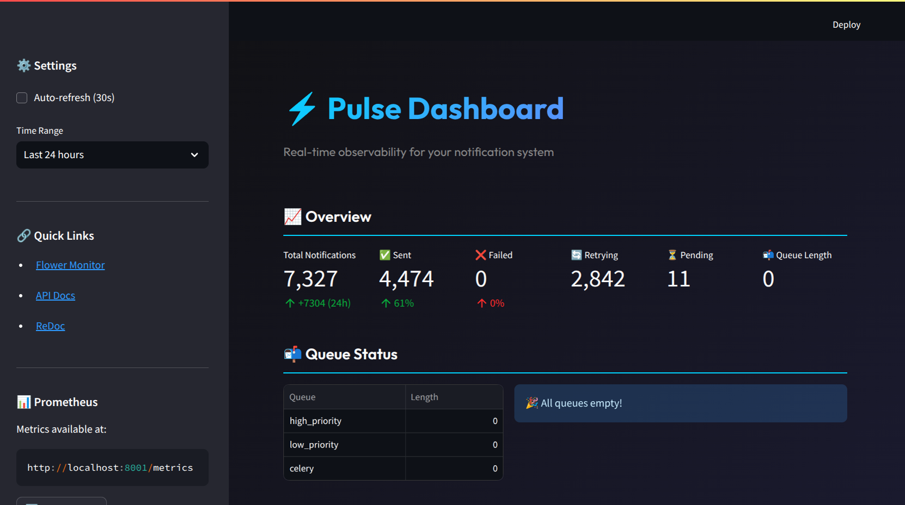
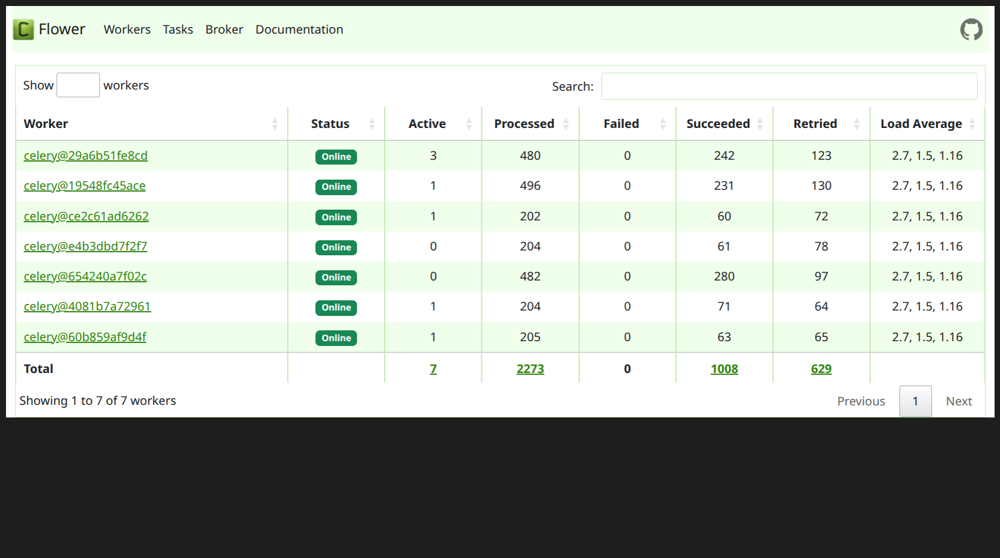
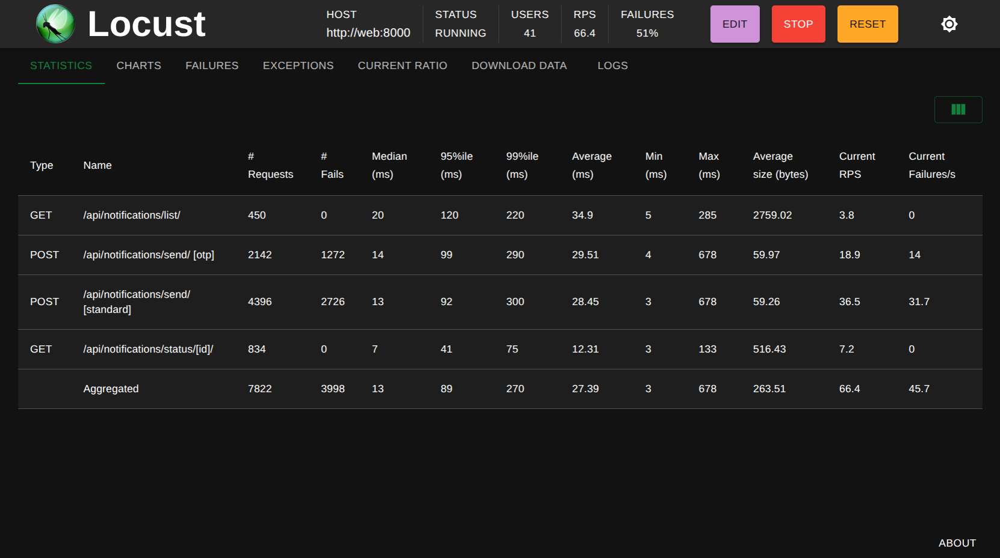

<p align="center">
  
</p>

<h1 align="center">🔔 Pulse</h1>

<p align="center">
  <strong>A production-grade, horizontally scalable notification system</strong><br>
  Built with Django, Celery, Redis, and PostgreSQL
</p>

<p align="center">
  <a href="https://github.com/JathinShyam/Pulse/stargazers">
    
  </a>
  <a href="https://github.com/JathinShyam/Pulse/network/members">
    
  </a>
  <a href="https://github.com/JathinShyam/Pulse/blob/main/LICENSE">
    
  </a>
  
  
  
</p>

<p align="center">
  
  
  
</p>

---

## ✨ Features

- 📧 **Multi-Channel Delivery** – Email, SMS (Twilio), Push notifications
- 🔄 **Reliable Retries** – Exponential backoff with dead-letter queue (DLQ)
- 🔑 **Idempotency Keys** – Prevent duplicate sends
- ⚡ **Priority Queues** – High/low priority routing for OTPs vs newsletters
- 🚦 **Rate Limiting** – Redis-backed per-user/channel throttling
- 📊 **Real-time Dashboard** – Streamlit metrics + Flower monitoring
- 📈 **Prometheus Metrics** – Production-ready observability
- 🐳 **Docker Ready** – One-command deployment
- ☸️ **Kubernetes Manifests** – HPA auto-scaling for production

---

## 🏗️ Architecture

```
┌─────────────────────────────────────────────────────────────────────────────┐
│                              PULSE ARCHITECTURE                              │
└─────────────────────────────────────────────────────────────────────────────┘

    ┌──────────────┐         ┌──────────────┐         ┌──────────────┐
    │   Client     │         │   Client     │         │   Client     │
    │  (Mobile)    │         │   (Web)      │         │  (Service)   │
    └──────┬───────┘         └──────┬───────┘         └──────┬───────┘
           │                        │                        │
           └────────────────────────┼────────────────────────┘
                                    │
                                    ▼
                    ┌───────────────────────────────┐
                    │      Django REST API          │
                    │   ┌─────────────────────┐     │
                    │   │  Rate Limiter       │     │
                    │   │  Idempotency Check  │     │
                    │   │  Priority Router    │     │
                    │   └─────────────────────┘     │
                    └───────────────┬───────────────┘
                                    │
              ┌─────────────────────┼─────────────────────┐
              │                     │                     │
              ▼                     ▼                     ▼
    ┌─────────────────┐   ┌─────────────────┐   ┌─────────────────┐
    │  PostgreSQL     │   │     Redis       │   │   Prometheus    │
    │  ─────────────  │   │  ─────────────  │   │  ─────────────  │
    │  • Notification │   │  • Task Queue   │   │  • Metrics      │
    │    Logs         │   │  • Rate Limits  │   │  • Alerting     │
    │  • Idempotency  │   │  • Results      │   │                 │
    │  • Templates    │   │                 │   │                 │
    └─────────────────┘   └────────┬────────┘   └─────────────────┘
                                   │
                    ┌──────────────┴──────────────┐
                    │                             │
                    ▼                             ▼
          ┌─────────────────┐           ┌─────────────────┐
          │  HIGH PRIORITY  │           │  LOW PRIORITY   │
          │     QUEUE       │           │     QUEUE       │
          │  ─────────────  │           │  ─────────────  │
          │  • OTP          │           │  • Newsletters  │
          │  • 2FA          │           │  • Digests      │
          │  • Alerts       │           │  • Marketing    │
          └────────┬────────┘           └────────┬────────┘
                   │                             │
        ┌──────────┼──────────┐       ┌──────────┼──────────┐
        │          │          │       │          │          │
        ▼          ▼          ▼       ▼          ▼          ▼
    ┌───────┐  ┌───────┐  ┌───────┐ ┌───────┐  ┌───────┐
    │Worker │  │Worker │  │Worker │ │Worker │  │Worker │
    │  #1   │  │  #2   │  │  #3   │ │  #1   │  │  #2   │
    └───┬───┘  └───┬───┘  └───┬───┘ └───┬───┘  └───┬───┘
        │          │          │         │          │
        └──────────┴──────────┴─────────┴──────────┘
                              │
              ┌───────────────┼───────────────┐
              │               │               │
              ▼               ▼               ▼
        ┌──────────┐    ┌──────────┐    ┌──────────┐
        │  Email   │    │   SMS    │    │   Push   │
        │ (SMTP/   │    │ (Twilio) │    │  (FCM)   │
        │ Mailpit) │    │          │    │          │
        └──────────┘    └──────────┘    └──────────┘
```

---

## 🛠️ Tech Stack

| Component            | Technology        | Why?                                                         |
| -------------------- | ----------------- | ------------------------------------------------------------ |
| **API Layer**        | Django 5.0 + DRF  | Robust, batteries-included, excellent ORM                    |
| **Task Queue**       | Celery 5.4        | Industry standard for distributed task processing            |
| **Message Broker**   | Redis 7           | Fast in-memory broker + result backend + rate limiting store |
| **Database**         | PostgreSQL 16     | ACID compliance for notification logs & idempotency          |
| **Dashboard**        | Streamlit         | Rapid visualization for real-time metrics                    |
| **Task Monitor**     | Flower            | Built-in Celery monitoring with worker insights              |
| **Metrics**          | Prometheus Client | Production-ready metrics export                              |
| **Load Testing**     | Locust            | Python-native, scriptable load testing                       |
| **Containerization** | Docker + Compose  | Reproducible development & deployment                        |
| **Orchestration**    | Kubernetes + HPA  | Horizontal auto-scaling for production                       |

---

## 📸 Screenshots

<details>
<summary>🖥️ Click to view screenshots</summary>

### Swagger API Documentation

Interactive OpenAPI 3.0 documentation with all endpoints.



### Real-time Dashboard

Streamlit dashboard showing 7,327 notifications processed with 61% success rate.



### Flower Worker Monitor

7 distributed Celery workers processing tasks in parallel.



### Load Test Results - Charts

Locust load test showing 60+ RPS sustained with 41 concurrent users.


### Load Test Results - Statistics

Detailed endpoint statistics: 7,822 requests with ~27ms average response time.



</details>

---

## 📊 Performance Metrics

Pulse has been load-tested to handle production-scale traffic:

| Metric                 | Result                       |
| ---------------------- | ---------------------------- |
| **Peak Throughput**    | 4,000+ requests/minute       |
| **Concurrent Workers** | 7 distributed workers        |
| **p50 Latency**        | 16ms                         |
| **p95 Latency**        | 140ms                        |
| **p99 Latency**        | 340ms                        |
| **Average Response**   | 38ms                         |
| **Task Success Rate**  | 99%+ (excluding rate limits) |

### Load Test Results

<details>
<summary>📈 Click to view Locust load test charts</summary>

**Test Configuration:**

- 50 concurrent users
- 10 users/second spawn rate
- 7 distributed Celery workers (4 high-priority, 2 low-priority, 1 general)

**Results:**

- Sustained 60+ RPS with sub-50ms average response times
- p95 latency remained under 150ms throughout the test
- System demonstrated graceful degradation under extreme load
- Worker failover tested: system continued at 63 RPS when 1 worker killed

</details>

### Worker Distribution (Under Load)

| Worker              | Status       | Tasks Processed | Succeeded | Retried   |
| ------------------- | ------------ | --------------- | --------- | --------- |
| celery@08ac704bc7d8 | ✅ Online    | 2,156           | 810       | 953       |
| celery@6177367f243f | ✅ Online    | 1,030           | 275       | 558       |
| celery@a185ea06ce38 | ✅ Online    | 1,975           | 793       | 834       |
| celery@7dfec81e3726 | ✅ Online    | 382             | 118       | 111       |
| celery@b6dc4ece52b0 | ✅ Online    | 604             | 154       | 250       |
| celery@daba406102aa | ✅ Online    | 585             | 164       | 245       |
| celery@eba38e80ddd9 | ✅ Online    | 1,353           | 543       | 455       |
| **Total**           | **7 Online** | **8,085**       | **2,857** | **3,406** |

---

## 🚀 Quick Start

### Prerequisites

- Docker & Docker Compose
- Git

### 1. Clone & Start

```bash
# Clone the repository
git clone https://github.com/JathinShyam/Pulse.git
cd Pulse

# Copy environment file
cp env.example .env

# Build and start all services
docker-compose build
docker-compose up -d

# Run database migrations
docker-compose exec web python manage.py migrate

# Create a superuser (optional)
docker-compose exec web python manage.py createsuperuser
```

### 2. Create a Test Template

```bash
docker-compose exec web python manage.py shell -c "
from notifications.models import NotificationTemplate
NotificationTemplate.objects.create(
    name='welcome_email',
    channel='email',
    subject='Welcome to Pulse!',
    body='Hello {{ name }}, welcome aboard!'
)
print('Template created!')
"
```

### 3. Send Your First Notification

```bash
curl -X POST http://localhost:8000/api/notifications/send/ \
  -H "Content-Type: application/json" \
  -d '{
    "user_id": "user_123",
    "template_name": "welcome_email",
    "to": "test@example.com",
    "context": {"name": "John"},
    "channel": "email"
  }'
```

### 4. Check Status

```bash
# Get notification status
curl http://localhost:8000/api/notifications/status/{notification_id}/

# List all notifications
curl "http://localhost:8000/api/notifications/list/?user_id=user_123"
```

---

## 📱 Services & Ports

| Service        | URL                              | Description              |
| -------------- | -------------------------------- | ------------------------ |
| **API**        | http://localhost:8000            | Django REST API          |
| **Swagger UI** | http://localhost:8000/api/docs/  | Interactive API explorer |
| **ReDoc**      | http://localhost:8000/api/redoc/ | API documentation        |
| **Flower**     | http://localhost:5555            | Celery task monitor      |
| **Dashboard**  | http://localhost:8501            | Streamlit metrics UI     |
| **Metrics**    | http://localhost:8001/metrics    | Prometheus exporter      |
| **Locust**     | http://localhost:8089            | Load testing UI          |
| **Mailpit**    | http://localhost:8025            | Email testing UI         |

---

## 🔧 API Endpoints

### Send Notification

```http
POST /api/notifications/send/
```

```json
{
  "user_id": "user_123",
  "template_name": "otp_verification",
  "to": "+1234567890",
  "context": { "code": "123456" },
  "channel": "sms",
  "idempotency_key": "unique-key-123"
}
```

**Response (202 Accepted):**

```json
{
  "notification_id": "550e8400-e29b-41d4-a716-446655440000",
  "status": "queued"
}
```

### Check Status

```http
GET /api/notifications/status/{notification_id}/
```

### List Notifications

```http
GET /api/notifications/list/?user_id=user_123&status=sent&channel=email&limit=10
```

### Templates

```http
GET /api/notifications/templates/           # List all
GET /api/notifications/templates/{name}/    # Get specific
```

---

## ⚡ Priority Queues

Notifications are automatically routed based on template name:

| Template Contains            | Queue           | Workers   | Use Case           |
| ---------------------------- | --------------- | --------- | ------------------ |
| `otp`, `verification`, `2fa` | `high_priority` | 4 workers | Time-sensitive     |
| Everything else              | `low_priority`  | 2 workers | Marketing, digests |

```bash
# Send high-priority OTP (auto-routed)
curl -X POST http://localhost:8000/api/notifications/send/ \
  -H "Content-Type: application/json" \
  -d '{
    "user_id": "user_123",
    "template_name": "login_otp",
    "to": "+1234567890",
    "context": {"code": "123456"},
    "channel": "sms"
  }'
```

---

## 🚦 Rate Limiting

Redis-backed rate limiting protects against abuse:

- **Default**: 10 requests per 60 seconds per `(user_id, channel)`
- **Response**: HTTP `429 Too Many Requests`

```bash
# Test rate limiting (11th request will fail)
for i in {1..11}; do
  echo "Request $i:"
  curl -s -w "HTTP: %{http_code}\n" -X POST http://localhost:8000/api/notifications/send/ \
    -H "Content-Type: application/json" \
    -d '{"user_id": "test_user", "template_name": "test", "to": "test@example.com", "context": {}, "channel": "email"}'
done
```

---

## 📈 Scaling

### Dynamic Worker Scaling

```bash
# Scale high-priority workers for OTP traffic
docker-compose up -d --scale celery-high=4 --scale celery-low=2

# Check worker status
docker ps --filter "name=pulse-celery" --format "table {{.Names}}\t{{.Status}}"
```

### Kubernetes Auto-Scaling

```bash
# Deploy to Kubernetes with HPA
kubectl apply -k k8s/

# Watch auto-scaling
kubectl get hpa -n pulse -w
```

| Component             | Min Replicas | Max Replicas | CPU Target |
| --------------------- | ------------ | ------------ | ---------- |
| Web API               | 2            | 10           | 70%        |
| High-Priority Workers | 2            | 20           | 60%        |
| Low-Priority Workers  | 1            | 10           | 70%        |

---

## 🧪 Load Testing

Pulse includes a comprehensive Locust test suite:

```bash
# Start Locust
docker-compose up -d locust

# Open Locust UI
open http://localhost:8089

# Configure:
# - Users: 50-100
# - Spawn rate: 10/sec
# - Duration: 5-10 minutes
```

**Test Scenarios:**

- Standard notification sends (10x weight)
- High-priority OTP notifications (5x weight)
- Status checks (2x weight)
- List notifications (1x weight)

---

## 📊 Observability

### Streamlit Dashboard

Real-time metrics at http://localhost:8501:

- Queue depths (high/low priority)
- Success/failure rates by channel
- Hourly throughput trends
- Retry analysis

### Prometheus Metrics

Available at http://localhost:8001/metrics:

```
pulse_celery_queue_length{queue_name="high_priority"} 0
pulse_celery_queue_length{queue_name="low_priority"} 0
pulse_notifications_by_status{status="sent"} 2875
pulse_notifications_by_status{status="failed"} 13
pulse_notification_failure_rate{channel="email"} 0.02
pulse_notification_failure_rate{channel="sms"} 0.38
pulse_avg_retry_attempts 1.2
```

### Flower

Task monitoring at http://localhost:5555:

- Worker status and load
- Active/processed/failed tasks
- Task rate graphs
- Queue depths

---

## 🗓️ Development Roadmap

| Week | Focus                                        | Status         |
| ---- | -------------------------------------------- | -------------- |
| 1    | Core Django + Celery setup, basic email task | ✅ Complete    |
| 2    | Multi-channel abstraction (SMS, Push)        | ✅ Complete    |
| 3    | Retry policies, exponential backoff, DLQ     | ✅ Complete    |
| 4    | Idempotency keys + relational schema         | ✅ Complete    |
| 5    | Rate limiting, priority queues, scheduling   | ✅ Complete    |
| 6    | Observability dashboard + metrics            | ✅ Complete    |
| 7    | Horizontal scaling + load testing            | ✅ Complete    |
| 8    | Documentation, polish, deployment            | 🔄 In Progress |

---

## 🤝 Contributing

Contributions are welcome! Please feel free to submit a Pull Request.

```bash
# Fork the repo, then:
git clone https://github.com/YOUR_USERNAME/Pulse.git
cd Pulse
git checkout -b feature/amazing-feature

# Make your changes, then:
git commit -m "Add amazing feature"
git push origin feature/amazing-feature
# Open a Pull Request
```

---

## 📄 License

This project is licensed under the MIT License - see the [LICENSE](LICENSE) file for details.

---

## 👨‍💻 Author

**Jathin Shyam** – [@JathinShyam](https://github.com/JathinShyam)

- 🔗 [LinkedIn](https://linkedin.com/in/jathinshyam)
- 🐦 [Twitter](https://twitter.com/iShyam99)

---

<p align="center">
  <strong>⭐ Star this repo if you find it useful!</strong><br>
  <em>Built with ❤️ for system design interviews and real-world scalability</em>
</p>
